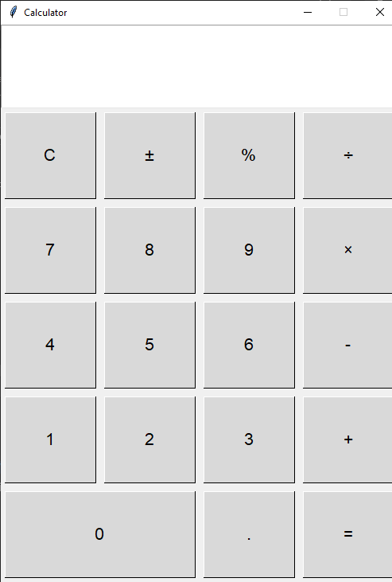

# Python Calculator

A simple calculator built using Python that supports basic arithmetic operations.


## Features
- Addition
- Subtraction
- Multiplication
- Division
- User-friendly interface with clear instructions

## Requirements
- Python 3.6 or later

## Installation
1. Clone the repository to your local machine:
   ```bash
   git https://github.com/akashpaul777/Calculator.py.git
